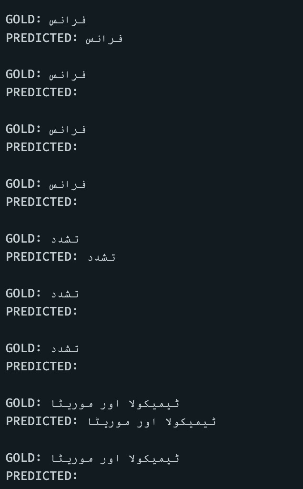
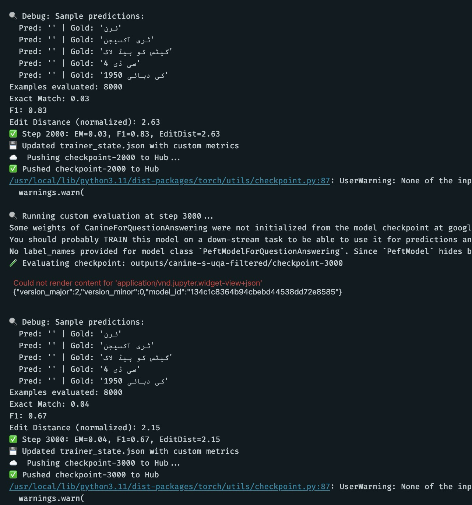
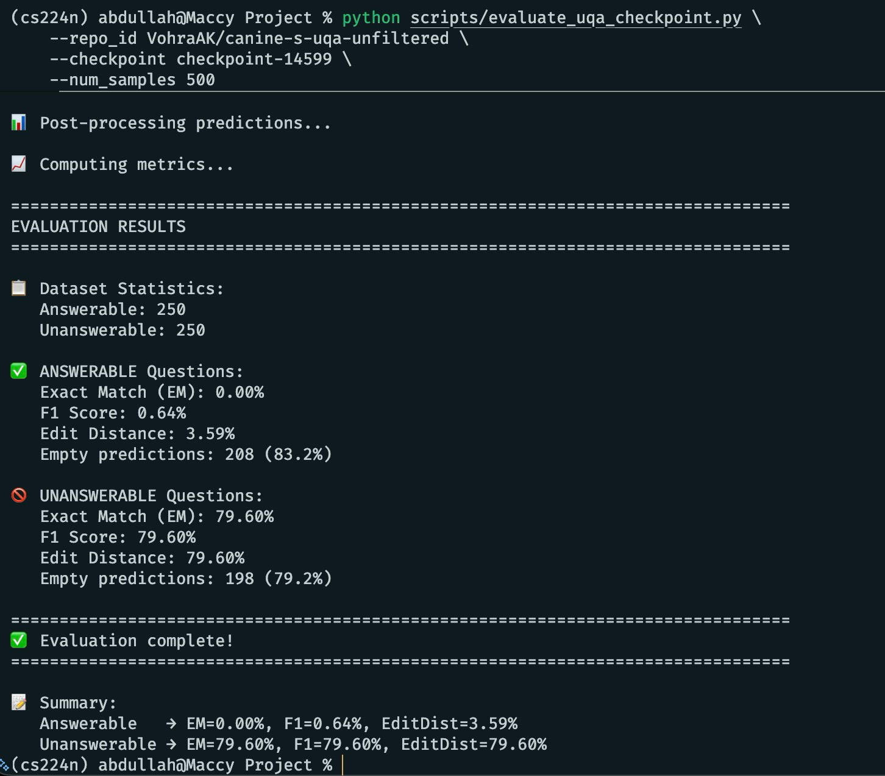
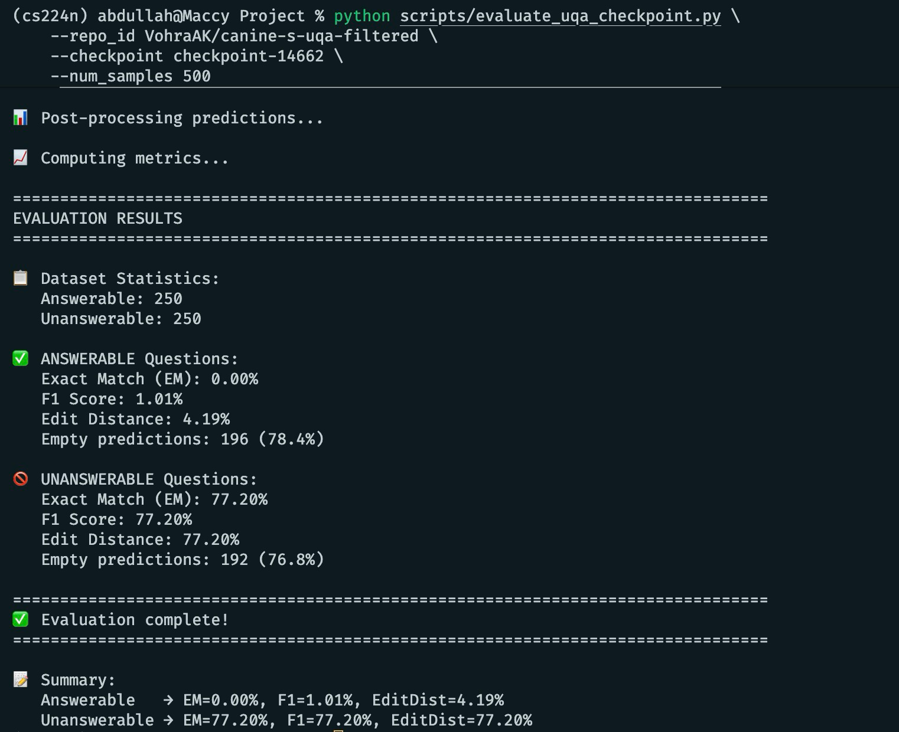

# Final Report Notes (talking points)

## Introduction
- CANINE family of encoders (`canine-c` and `canine-s`).
- Introduction to question-answering tasks (focus on extractive QA).
- Talk about trying out CANINE's strategy of character-level tokenisation on extractive QA tasks.
- Our goal: reproduce CANINE's results on its standard QA dataset (TyDi QA), then train CANINE on Urdu QA datasets to evaluate encoder's performance.

## Related Works (briefly duscus their contents):
- https://arxiv.org/abs/2103.06874 (CANINE paper)
- https://arxiv.org/abs/2003.05002 (TyDi QA paper, mention dataset structure and primary_task / secondary_task contents).
- https://arxiv.org/abs/2405.01458 (UQA paper, discuss dataset structur, translation of SQuAD dataset to Urdu, e.t.c.).

--- 

## Methodology:

### 1. Reproducing on TyDiQA (primary_task) with CANINE-C:

**Model Selection:** We used `google/canine-c` (132M parameters), a character-level transformer that eliminates explicit tokenization, making it ideal for multilingual QA tasks.

**Dataset Sampling:** Due to compute and time constraints, we sampled 2,000 training examples and 500 validation examples from TyDiQA's primary task (minimal answer extraction across 11 languages: Arabic, Bengali, English, Finnish, Indonesian, Japanese, Kiswahili, Korean, Russian, Telugu, Thai). The dataset contains ~50% answerable and ~50% unanswerable questions.

**Parameter-Efficient Fine-Tuning:** We applied LoRA (Low-Rank Adaptation) with rank r=8, alpha=32, targeting attention query/value layers. This resulted in only 345,602 trainable parameters (0.26% of total model), significantly reducing memory and compute requirements while maintaining performance.

**Training Setup:** Single epoch training with batch size 1, gradient accumulation of 16 steps (effective batch size=16), learning rate 3e-5, sequence length 384, and doc stride 64. Training was performed with FP16 precision.

**Preprocessing Strategy:** Converted TyDiQA's byte-level offsets to character indices (leveraging CANINE's 1:1 character-token mapping), implemented sliding window approach for long documents, and handled no-answer cases by pointing start/end positions to [CLS] token.

**Evaluation:** Custom evaluation computed Exact Match (EM), F1 Score, and normalized Edit Distance. Best predictions were selected across all sliding window chunks per question.

**Results:** Achieved **64.20% EM** and **64.20% F1** at checkpoint-7000. This closely matches the original CANINE paper's reported ~66% F1 on TyDiQA primary task despite using only 2,000 training samples (vs. full dataset) and <0.3% trainable  parameters.

### 2. Evaluating CANINE-S on UQA:

#### a) First try: initial preprocessing attempt with byte-level offsets:

- **Offset format mismatch:** TyDiQA provides answer positions as byte-level offsets (UTF-8 byte index), while UQA natively provides character-level offsets (direct character position). Our initial preprocessing directly adapted TyDiQA's byte-to-character conversion logic to UQA data.

- **Preprocessing failure:** Validation revealed garbage training examples—predicted answer spans within sliding window chunks failed to match gold answers, producing unusable training data where the model would learn incorrect span boundaries.

#### b) Secind try: corrected preprocessing with character-level offsets:

- **Direct character offset usage:** Redesigned preprocessor (`fixed_preprocess_uqa.py`) to eliminate all byte conversion logic and directly utilize UQA's native character-level offsets.
- **CANINE's 1:1 character-token mapping:** Leveraged CANINE's defining property where each character maps to exactly one token (verified on UQA: 1,850 characters = 1,850 tokens), eliminating tokenization-level misalignment.
- **TyDiQA-style sliding window:** Maintained sliding window strategy (max_length=384, doc_stride=64) with [CLS] token handling for chunks without answers.
- **Preprocessing validation:** Achieved 99.5% accuracy on 200 random examples—all answerable questions now had at least one chunk containing the correct answer span.

#### c) Training experiments with CANINE-S:

We switched to `google/canine-s` based on its pretraining objective. Unlike CANINE-C (which predicts characters), CANINE-S is trained with a subword loss, meaning it learns to predict subword tokens while reading characters. We hypothesized this would better capture Urdu's morphological richness. However, as our results demonstrate, this hypothesis did not hold—CANINE-S failed to meaningfully learn span extraction on UQA.

**Model Configuration:**
- **Base model:** `google/canine-s` (smaller variant compared to CANINE-C used for TyDiQA)
- **LoRA fine-tuning:** Rank r=8, alpha=32, targeting query/value layers
- **Trainable parameters:** 345,602 (0.26% of total model)
- **Training setup:** Single epoch, batch size 4, gradient accumulation 4 (effective batch size=16), learning rate 3e-5, FP16 precision
- **Evaluation:** Every 1,000 steps on 8,000 validation examples

##### i) Unfiltered UQA experiment:

- **Dataset composition:** Complete UQA dataset (124,745 examples) contains `is_impossible` field marking unanswerable questions, similar to SQuAD 2.0 format. Natural distribution: ~66% answerable, ~34% unanswerable.
- **Training sample:** Used full unfiltered training set to preserve natural answerable/unanswerable distribution.
- **Results (canine-s-uqa-unfiltered, checkpoint-14599):**
  - Exact Match: **32.81%**
  - F1 Score: **32.90%**
  - Edit Distance: **33.12%**
- **Performance analysis:** Model achieved ~33% metrics, closely correlated with the proportion of unanswerable questions in dataset. Investigation revealed model predominantly predicted [CLS] (no answer) for both answerable and unanswerable questions.

##### ii) Filtered UQA experiment (answerable-only):

- Official UQA repository (https://github.com/sameearif/UQA/) and paper revealed XLM-RoBERTa baseline was trained exclusively on answerable questions, filtering out all impossibles.
- **Dataset filtering:** Applied `is_impossible == False` filter, reducing 124,745 → 83,018 training examples (100% answerable). Used 80,000 for training, 8,000 for validation.
- **Results (canine-s-uqa-filtered, checkpoint-14662):**
  - Exact Match: **0.04%**
  - F1 Score: **0.36%**
  - Edit Distance: **1.19%**
  - Training loss: 3.82 (decreased normally from ~6.0)
- Despite correct preprocessing and decreasing training loss, **model produced predominantly empty predictions** (`Pred: ''`) even for answerable-only dataset.
- **Debug observations:** Sample predictions consistently showed `Pred: '' | Gold: 'فرن'` (Urdu text). Performance showed no meaningful learning—EM remained <1% throughout training.
- We hypothesize that the model was driven to always predict [CLS] because it was a convenient low-loss strategy.

---
#### 50-50% answerable to unanswerable ratio evaluation:

**Motivation:** To test hypothesis of whether the overall metrics were the result of answerable or unanswerable performance, we evaluated latest checkpoints of both filtering-strategy models on a balanced 500-sample batch (250 answerable, 250 unanswerable).

**Key Findings:**
- **Unfiltered checkpoint:** Answerable EM=0.00% (83% empty predictions), Unanswerable EM=79.60% (79% empty predictions)
- **Filtered checkpoint:** Answerable EM=0.00% (78% empty predictions), Unanswerable EM=77.20% (77% empty predictions)
- **Critical insight:** Both models predict empty/[CLS] for ~80% of ALL questions, regardless of whether they're answerable. The overall ~33% EM in unfiltered training was entirely driven by correctly predicting "no answer" for unanswerable questions (0.34 × 0.80 ≈ 0.27).

**Implication:** This confirms our hypithesis. The model learned that predicting [CLS] was low-loss and never developed span-extraction capabilities.

1. **Unfiltered 50/50 Batch Evaluation**:

 

2. **Filtered 50/50 Batch Evaluation**:

---

#### Analysis: Why did CANINE-S fail on UQA?

- **Dataset distribution mismatch:** UQA's filtered version (100% answerable) contrasts with TyDiQA's natural 50/50 answerable/unanswerable split. CANINE's pretraining likely learned to balance answer extraction with no-answer detection. Training exclusively on answerables may have confused this mechanism.
- **Monolingual training limitation:** TyDiQA's 11 languages provide diverse morphological patterns aiding CANINE's learning, while UQA is only Urdu (translated SQuAD v2 data using EATS method may also add incorrect and incoherent semantics).
- **Chunk-level training collapse:** Validation revealed only 34% of sliding window chunks contained correct answer spans—66% trained on [CLS] predictions. During inference, chunk aggregation strategy (selecting highest logit confidence) systematically favored [CLS], creating cascade where empty predictions outscored legitimate spans.

#### Limitations and potential solutions:

- **Hyperparameter optimization:** Learning rate 3e-5 (borrowed from TyDiQA) may be suboptimal. Unfiltered experiment's 33% suggests exploring higher rates (5e-5, 1e-4) or increased LoRA rank (r=16 or 32) for sufficient capacity to learn Urdu patterns.
- **Model capacity:** CANINE-C's 132M parameters may be necessary for UQA's morphological complexity. Alternative: test mBERT or XLM-RoBERTa baselines (achieved 70-80% EM on UQA per original paper).
- **Training strategy refinement:** Reintroduce unanswerable questions in controlled ratios (starting with 50/50, gradually adjusting). Multi-stage training: first on answerables only, then fine-tune with impossibles to prevent no-answer collapse.
- **Preprocessing improvements:** Current 34% answer coverage rate suggests reducing doc_stride (48 vs 64) to increase chunk overlap, ensuring more chunks contain answer spans for richer training signal.